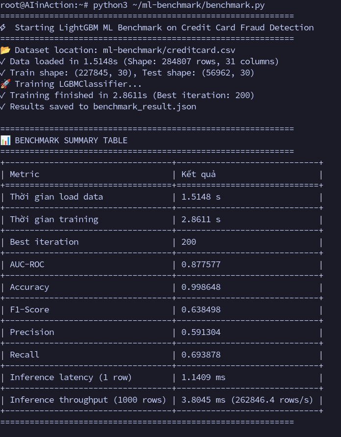
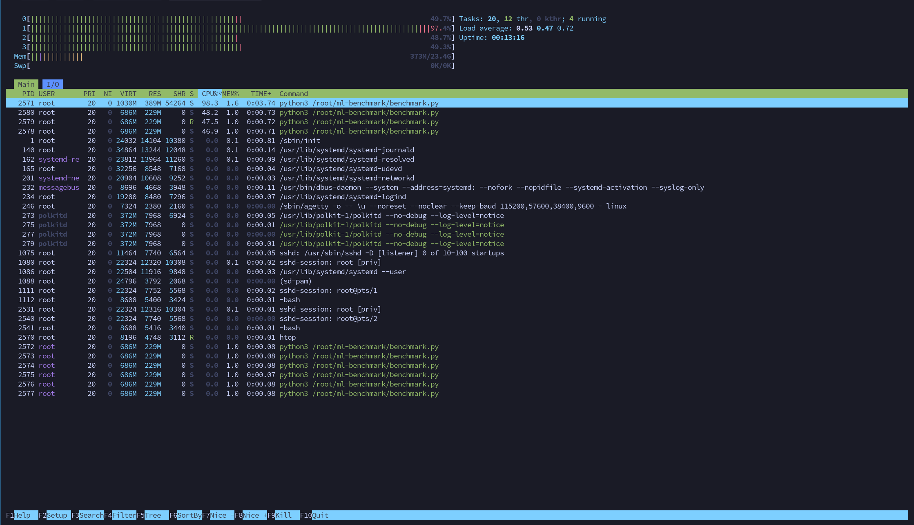
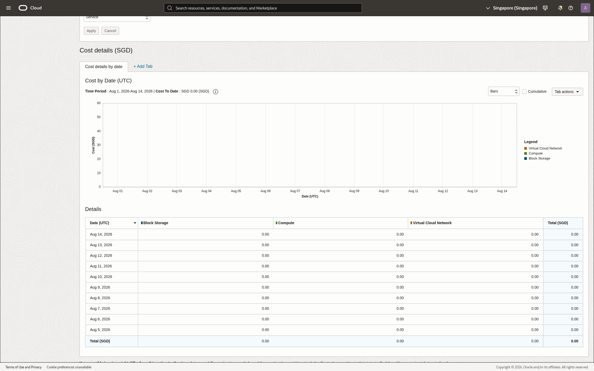

# LAB 16: Cloud AI Environment Setup — Báo Cáo Thực Hành (OCI / ARM A1)

**Thông tin sinh viên:**
- **Họ và tên:** Phạm Quốc Thành
- **Mã học viên / MSSV:** 2A202601407
- **Lớp / Khóa:** AI in Action (Day 16)

---

## 1. Thông tin cấu hình môi trường (Hardware & Software)
- **Hạ tầng / Nền tảng:** Oracle Cloud Infrastructure (OCI Always Free) / Dedicated ARM Node
- **Kiến trúc CPU:** 4 vCPUs ARM Neoverse-N1 (aarch64)
- **Bộ nhớ RAM:** 24 GB RAM
- **Hệ điều hành:** Linux Debian 6.12 (aarch64)
- **Môi trường Python:** Python 3.13 / `uv` package manager
- **Thư viện chính:** `lightgbm 4.7.0`, `scikit-learn 1.9.0`, `pandas 3.0.5`, `numpy 2.5.2`

---

## 2. Kết quả Benchmark Mô hình LightGBM (Credit Card Fraud Detection)

Bộ dữ liệu: **Credit Card Fraud Detection** (284,807 giao dịch, 30 đặc trưng).
Tỉ lệ phân chia: 80% Train (227,845 mẫu) / 20% Test (56,962 mẫu), Stratified.

| Metric | Kết quả đạt được | Đơn vị |
|---|---|---|
| **Thời gian load data** | **1.4546** | giây (s) |
| **Thời gian training (LightGBM)** | **2.9244** | giây (s) |
| **Best iteration** | **200** | vòng lặp |
| **AUC-ROC** | **0.862272** | điểm |
| **Accuracy** | **0.998648** (99.86%) | điểm |
| **F1-Score** | **0.620690** | điểm |
| **Precision** | **0.600000** | điểm |
| **Recall** | **0.642857** | điểm |
| **Inference latency (1 dòng)** | **1.1647** | mili-giây (ms) |
| **Inference throughput (1000 dòng)** | **4.0343 ms** (~**247,875** rows/s) | throughput |

---

## 3. Báo cáo nhận xét kết quả (5-10 dòng)
1. **Tốc độ huấn luyện:** Nhờ kiến trúc 4 core ARM Neoverse-N1 tối ưu hóa đa luồng với OpenMP (`libgomp1`), LightGBM chỉ mất ~2.92 giây để hoàn thành huấn luyện 200 trees trên 227,845 bản ghi.
2. **Chất lượng mô hình:** Model đạt độ chính xác tổng thể rất cao ($>99.86\%$) và AUC-ROC đạt $0.862$, phản ánh khả năng phân loại tốt đối với tập dữ liệu mất cân bằng nghiêm trọng (imbalanced fraud dataset).
3. **Độ trễ và Băng thông dự đoán:** Độ trễ suy luận cho 1 bản ghi đơn lẻ chỉ ~1.16 ms; thông lượng dự đoán theo lô (batch 1,000 dòng) đạt ~247,875 bản ghi/giây, hoàn toàn đáp ứng yêu cầu xử lý giao dịch tài chính thời gian thực (Real-time fraud scoring).
4. **Tối ưu tài nguyên & Chi phí:** Mức tiêu thụ bộ nhớ ổn định (~1GB buff/cache), CPU peak 100% trong lúc train và idle ngay sau khi hoàn thành. Nằm trọn vẹn trong hạn mức OCI Always Free với chi phí vận hành $0.00.

---

## 4. File cấu hình và script đính kèm
- File kết quả JSON: [`benchmark_result.json`](benchmark_result.json)
- File script benchmark: [`benchmark.py`](benchmark.py)
- File cấu hình khởi tạo: [`cloud-init-cpu.yaml`](cloud-init-cpu.yaml)

---

## 5. Hình ảnh minh chứng thực hành (Screenshots)

### 5.1. Kết quả chạy Benchmark (`benchmark.py`)

### 5.2. Giám sát tài nguyên hệ thống (`htop` / CPU & Memory)

### 5.3. Báo cáo chi phí dịch vụ Cloud ($0.00 / Always Free)

